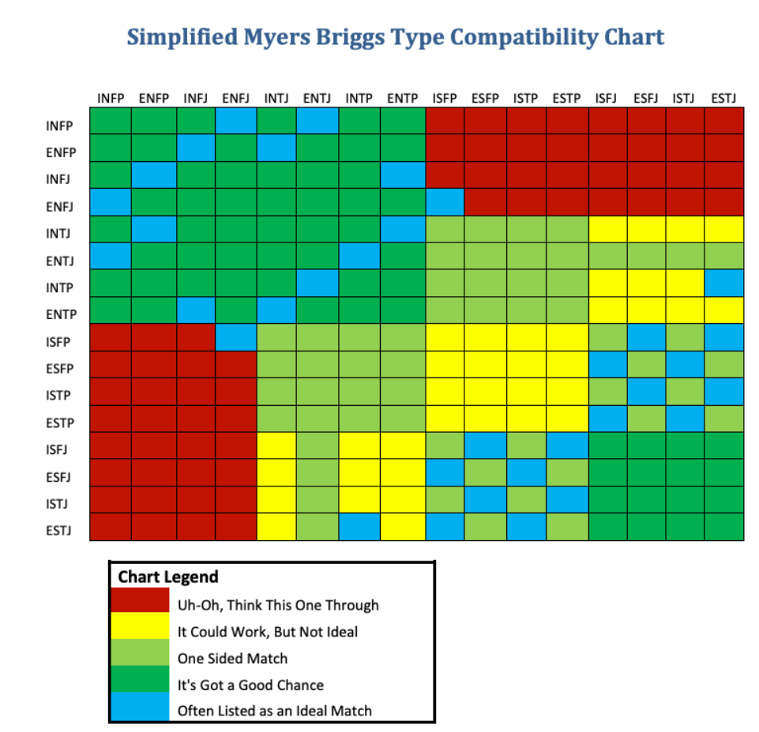

# Match% - Overview

Match% is basically a dating site that will use data from external sources (that users already have) in order to better match them with people who "empirically" have similar interests or compatibility in some form. 

# Data Sources
Match% Compatibility Score will be an average of several other scores from different sources (example: Personality Compat = 75%, YT Compat = 25%, Spotify Compat = 55%, so Overall = 51.6%). The following are implemented and potential data sources: 

- Personality Type Compatibility - Done - Use Myers Briggs personality type compatibility chart 

- YouTube - 1st priority - use YT API to compare watch history, ad-relevant keywords, etc. to determine and compare interests

- Spotify - Low priority - use Spotify API to compare top x artists by time listened

- Steam - Medium priority - use Steam API to compare top played games by time spent

# Screenshots (Mockup)
Screenshots say "Date%" because they are from the earlier planning stage and don't reflect the current state of the application. However, I'm using these because I don't want to keep updating these screenshots as the actual site starts to look more and more like the mockup from the planning stage. As of writing this readme, I am in the middle of styling so a lot of things are changing very frequently.

  
"Index" page    
  
Match% Compatibility Score    
  
Messages    

# Technologies Used

- React
- Mongoose
- Express
- JavaScript
- HTML
- CSS
- Git/Github
- Heroku

# Getting Started

https://matchpercent-690abbbcf0bf.herokuapp.com

# Next Steps

- Remake the models so that everything is just in one user model rather than splitting information between user and profile models. This will make everything a lot simpler and easier to enact other changes.

- Add more profile details such as age, location, more gender options, etc.

- Allow photo upload

- Like, Dislike, & Match functionality

- Messages functionality

- Filter by gender preferance on profile list page

- Exclude active user's profile from profile list page

- Fix profile edit form deleting values left blank on accepting changes

- Redirect to Auth Page after deleting user

- Change index page to show one profile at a time rather than all of them at once (unless all at once is a design choice?) (See ProfileListPage.css)

- Support more than one picture where you can scroll through them in a row where the first one is currently

- Include data from APIs (YouTube, Steam, Spotify, etc.) to calculate compatibility percentages

- Make the header and Like/Dislike buttons "sticky" so they stay on the screen when scrolling someone's profile (unless design choice?)

- Resize/redo the like & dislike buttons